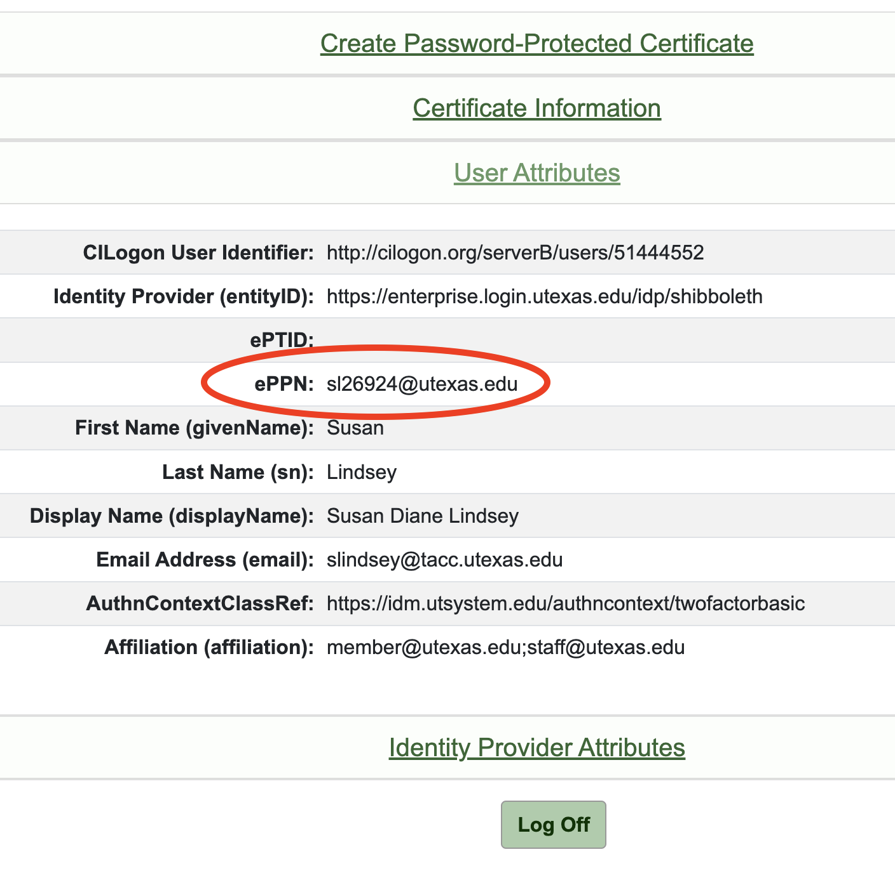
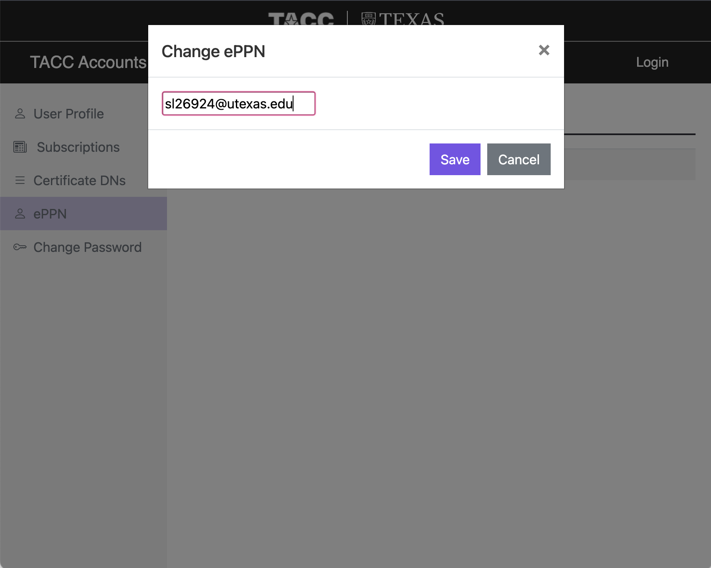

## Globus v5.4 Transition { #globusv54 }
*January 8, 2024*

Beginning Monday, January 8th, 2024, Globus will be transitioning to version 5.4. This transition will impact all TACC researchers who use Globus and will require you to update your profile with your ePPN (an acronym-to not-worry-about) to continue using the Globus service. 

1. Login to [CILogon](https://cilogon.org) and click on "User Attributes":

	{: style="width:500px"}

1. Login to your [TACC user profile](https://accounts.tacc.utexas.edu) and click "ePPN" on the left menu:

	{: style="width:500px"}

* Enter your ePPN from Step 1 in and save.  Allow at least 15 minutes for your change to propagate through the system. 

	{: style="width:500px"}

Once you've completed these steps, you will be able to use the [Globus File Manager](https://app.globus.org) as usual.  If you encounter any issues, please [submit a support ticket](https://tacc.utexas.edu/portal/tickets).

!!! important
	**Select an endpoint that has "GCS v5.4" in the title.**

---
## Globus Data Transfer Guide { #globus }

Globus supplies high speed, reliable, asynchronous transfers to the portal. Globus is fast, for large volumes of data, as it uses multiple network sockets simultaneously to transfer data. It is reliable for large numbers of directories and files, as it can automatically fail and restart itself, and will only notify you when the transfers are completed successfully.

To get these benefits there are a few setup steps you have to do beyond the normal Data Depot transfer process. Most of the steps you are only required to do once when you set up Globus to use for the first time. Several steps will need to be repeated each time you set up a new computer to use Globus for the portal. Once you are set up, you can use Globus not only for transfers to and from the portal, but also to access other cyberinfrastructure resources at TACC and around the world.

To start using Globus, you need to do two things: Generate a unique identifier for all Globus services, and enroll the machine you are transferring data to/from with Globus (this can be your personal laptop or desktop, or a server to which you have access). Follow this one-time process to set up the Globus file transfer capability.

*   [Step 1: Retrieve and Associate a Distinguished Name (DN) with Your TACC Account](#step1)
*   [Step 2: Activate Your Desktop/Laptop as a Globus Endpoint and Transfer Files](#step2)

PLEASE NOTE: You must use _your institution’s credentials and not your personal Google account_ when setting up Globus. If you use a personal account, you will encounter an issue with the transfer endpoint (Frontera, Stampede2, Corral, Ranch, etcetera).

### Step 1: Retrieve and Associate a Distinguished Name (DN) with Your TACC Account { #step1 }

In order for Globus to know who you are when you move data in and out of the CEP portal from your computer, or between any other pair of systems, Globus needs a unique identifier for you, which is called a “Distinguished Name”, or DN. You can generate a DN instantly for free. To create a DN, you need to log in from some authoritative source that can verify your identity, typically your university or employer. If you already have a DN from another source, you can use that. If you do not, you can associate one with your account from many of the major universities in the world via the “CI Logon” service.

To retrieve your DN, go to [https://cilogon.org](https://cilogon.org/) in your browser. Select an Identity Provider from the drop-down list, and click "Log On" which will take you to the login screen for the Identity Provider you selected. If your university or employer is not in the list, we recommend [registering for an XSEDE account](https://portal.xsede.org/#/guest) as XSEDE is a CILogon Identity Provider.

After successfully authenticating at your chosen Identity Provider, you are redirected back to CILogon, where you can find your Certificate Subject that you will need to copy and paste in the next step:

    /DC=org/DC=cilogon/C=US/O=University of Texas at Austin/CN=Sample Person A00000

Login to the [TACC User Portal](https://portal.tacc.utexas.edu/) and select "Manage Account" under your login name in the top right corner.

{: style="width:600px"}

Click on the "Manage DNs" on the Manage Account page.   

{: style="width:500px"}

You will be presented with a list of the DNs currently associated with your TACC account and a text field to associate a new DN to your account. Enter the Certificate Subject obtained from [CILogon.org](http://cilogon.org/) in the text field. Click the button to "Link DN". This will associate the new DN with your account. **Please allow up to 30 minutes for this change to propagate across all TACC systems**.

{: style="width:600px"}

### Step 2: Activate Endpoint and Transfer Files { #step2 }

Step 2: Activate Your Desktop/Laptop as a Globus Endpoint and Transfer Files { #step-2-globus-endpoint }

Now that you have associated the DN with your TACC account and given the DN time to propagate to the systems (up to thirty minutes), you can activate the Globus transfer endpoints and begin transferring files.

Go to [https://globus.org](https://globus.org/) and log in.

 

Upon successful login you, you will be directed to the "File Manager" landing page.

 

Click on Endpoints.

 

Click “+ Create new endpoint” and follow the instructions to set up your desktop/laptop as an endpoint.

 

Enter a Display Name to identify your local endpoint like My Laptop, My Desktop at Home, etcetera and then click Generate Setup Key and click copy to copy the Personal Setup Key.

Download and Install the Globus Connect Personal client.

After install, open the Globus Connect Personal application. A pop menu pops up asking your setup key. Copy the setup key from the previous step to complete the setup.

Click on “File Manager”, and next click on the Collection field. You can choose "Your collections" and click on "My Laptop" to select the created endpoint to your computer.

 

You can now access the files on your desktop/laptop via Globus.

 

You can also click on Panels to look at two endpoints at the same time. In the other transfer endpoint, search for "TACC" and select the appropriate allocation storage system (Frontera, Stampede2, Corral, Ranch, etcetera) for the desired data.

<!--  See how this is rendered in cep.tacc. 
/// details | Examples:

    UTRC Portal
    :   Example A
        :   Data
            :   My Data
        :   System
            : TACC Stampede2
    :   Example B
        :   Data
            :   Shared Workspaces
        :   System
            :   TACC Corral 3
    Frontera Portal
    :   Example A
        :   Data
            :   My Data
        :   System
            :   Frontera, Longhorn, Stockyard
    :   Example B
        :   Data
            :   Shared Workspaces
        :   System
            :   Corral

///
-->

 

After successfully authenticating, you will be redirected back to Globus and you will now be able to access your data on the allocation storage system (Frontera, Stampede2, Corral, Ranch):

### Examples

To access "My Data", use the appropriate endpoint and set "Path" to the path of your `$WORK` location on your system.

*   To find that path, run the following commands in a terminal.

		localhost$ ssh username@host

		[authenticate with your password and TACC Token]

		login2(#)$ cd $WORK
		login2(#)$ pwd

*   The output of the `pwd` command is your path to your `$WORK` directory.

&nbsp;   | Stampede | Frontera | Lonestar6
-- | -- | -- | --
**Endpoint** | Stampede | Frontera | Lonestar6
**Hostname** | `stampede2.tacc.utexas.edu` | `frontera.tacc.utexas.edu` | `ls6.tacc.utexas.edu`

*   To access a project in "My Projects" use the appropriate endpoint and set <samp>Path</samp> to: <code>/<kbd>path/to/storage</kbd>/<kbd>PORTAL</kbd>/projects/<kbd>PORTAL-ProjectIDNumber</kbd></code>

	`/corral-repl/tacc/aci/FRONTERA/projects/FRONTERA-26`

You will find the Project ID on your “My Projects” list in the second column.

 
  

<!-- 

-->

If you are viewing a project, the Project ID will be appended to the URL in your browser as:

<!-- https://<kbd>portal.domain</kbd>/workbench/data/tapis/projects/<kbd>portal</kbd>.project.<kbd>PORTAL-ProjectIDNumber</kbd> -->

	https://frontera-portal.tacc.utexas.edu/workbench/data/tapis/projects/frontera.project.FRONTERA-23

To access "Community Data", use the appropriate endpoint and set <samp>Path</samp> to: <code>/<kbd>path/to/portal/data</kbd>/<kbd>PORTAL</kbd>/community/</code>

* `/corral-repl/tacc/aci/UTRC/community/` 
* `/corral-repl/tacc/aci/Frontera/community/`

You can transfer files between the selected endpoints.

Once the transfer is initiated, you can see the task id for the transfer being initiated.

Click activity to check status on all the transfers you have initiated.

You will also receive an email to the registered email address once the transfer is completed.
