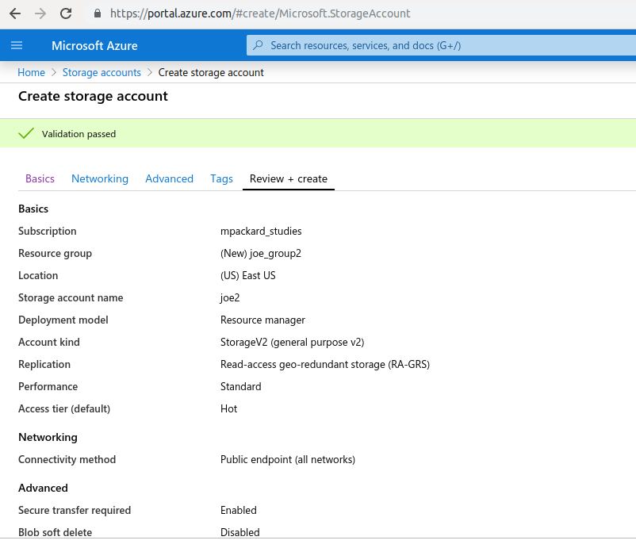

## [Cloud Services Integration](#cloudservices) { #cloudservices }

Frontera's design includes a totally new integration with cloud services, providing users with new options for data storage and access to emerging computing technologies. 

For projects utilizing data of exceptional importance - such as may result from an especially difficult physical experiment or a long-running simulation that is impractical to repeat - users have access to a cloud-based storage mirror that provides protection beyond the level already provided with TACC's redundant archive storage system. This capability relies upon the storage solutions of our cloud partners Microsoft, Google, and Amazon. For users who need this level of data protection, we provide storage capacity during the term of Frontera's operation by awarding credits for users to store data with our cloud partners. 

Users may access emerging computational capabilities (such as Tensor processors) that run on specially-designated processors at Google, Microsoft, and Amazon. This allows us to regularly refresh the project with novel computing technologies, while providing a real-world platform for users to explore the future of their science applications.

### [Google Cloud Platform](#cloudservices-google) { #cloudservices-google }

TACC now offers Frontera users access to Google Cloud Platform.

#### [Request Access](#cloudservices-google-requestaccess) { #cloudservices-google-requestaccess }

Please [create a support ticket][HELPDESK] requesting access to TACC Frontera's Google Cloud Platform. Do not proceed with the following steps until an admin has responded and configured your account appropriately.


1. Install

	Follow these detailed instructions to install the Google Cloud SDK on Linux platforms: [Installing Google Cloud SDK](https://cloud.google.com/sdk/docs/install#linux).

1. Download and extract

	```cmd-line
	login1$ curl -O https://dl.google.com/dl/cloudsdk/channels/rapid/downloads/google-cloud-sdk-335.0.0-linux-x86_64.tar.gz
	login1$ tar -xzf google-cloud-sdk-335.0.0-linux-x86_64.tar.gz
	```

1. Authenticate and configure

	```cmd-line
	login1$ ./google-cloud-sdk/bin/gcloud auth login
	```

	* You'll be presented a URL to paste into a browser; Log in using the appropriate Google account. 
	* You'll then be presented an authentication string. Copy and paste this string when promped with: "Enter verification code:".  
	* Configure the CLI for the correct project. For Frontera, use `ut-tacc-np-sandbox-1`.

	```cmd-line
	login1$ ./google-cloud-sdk/bin/gcloud config set project ut-tacc-np-sandbox-1
	```

#### [Storage basics](#cloudservices-google-storage) { #cloudservices-google-storage }

Learn the basic `gsutil` commands: [Quickstart: Using the `gsutil` tool](https://cloud.google.com/storage/docs/quickstart-gsutil)

**Example: list storage elements:**

```cmd-line
login1$ ./google-cloud-sdk/bin/gsutil ls
```

### [Amazon Web Services (AWS)](#cloudservices-amazon) { #cloudservices-amazon }

TACC now offers Frontera users access to Amazon Web Services. 

#### [Request Access](#cloudservices-amazon-requestaccess) { #cloudservices-amazon-requestaccess }

Please [create a support ticket][HELPDESK] requesting access to TACC Frontera's Amazon Web Services. Do not proceed with the following steps until an admin has responded and configured your account appropriately.

#### [Log In to the Console](#cloudservices-amazon-login) { #cloudservices-amazon-login }

If you are a new user then you should have received an email "Welcome to Amazon Web Services" containing a temporary password. Follow the instructions below to set up your AWS account.

Log in to the [Amazon Web Services Console](https://console.aws.amazon.com) with the following information: 

* Enter "203416866386" in the "Account ID" field 
* Enter your [Frontera User Portal](https://frontera-portal.tacc.utexas.edu/) ID in the "IAM user name" field.
* New users enter the temporary password contained in your welcome email, then reset your password.  
	<figure id="login"> 
	<figcaption></figcaption></figure>

#### [Add MFA](#cloudservices-amazon-mfa) { #cloudservices-amazon-mfa }

Follow these instructions to enable MFA on your account. **Do not navigate away from the MFA window during the pairing process, or else your account may be left in an unstable state.** 

1. From the top menu "username@2034-1686-6386", select "My Security Credentials"  
	<figure id="securitycredentials"> 
	<figcaption></figcaption></figure>

1. Click on the "Assign MFA device" button in the "Multi-factor authentication (MFA)" section. Then, select the "Virtual MFA device" option and click "Continue".  
	<figure id="managemfadevice"> 
	<figcaption></figcaption></figure>

1. Choose an Authentication method. Scroll down to see a list of free options. Many TACC users employ Duo Mobile or Google Authenticator. Open the authenticator app of your choice, scan the displayed QR code to add the account, then input the MFA codes as directed. 
	<figure id="mfaapplications"> 
	<figcaption></figcaption></figure>

1. Once the pairing process is completed, sign out and then log back in. **You will not be able to successfully proceed to the next step without doing so.**

#### [Add CLI and API access key](#cloudservices-amazon-keys) { #cloudservices-amazon-keys }

!!! important
	You must set up MFA and use it to log in to the AWS console prior to viewing or editing your access keys.

1. Once again, select "My Security Credentials" from the top menu, then click the "Create access key" button in the "Access keys for CLI, SDK, & API access" section.  
	<figure id="accesskeyavailable"> 
	<figcaption></figcaption></figure>

1. Install CLI: Follow the instructions at <https://docs.aws.amazon.com/cli/latest/userguide/install-cliv2.html>.
1. For more info see [Managing Access Keys for IAM Users](https://docs.aws.amazon.com/IAM/latest/UserGuide/id_credentials_access-keys.html)

#### [All Set](#cloudservices-amazon-allset) { #cloudservices-amazon-allset }

Now that your account is set up, you have access to the AWS S3 functionality. See the full documentation at <https://docs.aws.amazon.com/s3/index.html>.


### [Microsoft's Azure](#cloudservices-azure) { #cloudservices-azure }

Frontera's cloud service integration begins with Microsoft's Azure Service. 

#### [Request Access](#cloudservices-azure-requestaccess) { #cloudservices-azure-requestaccess }

Please [submit a support ticket][HELPDESK] and a TACC admin will grant you access to the [Microsoft Azure Portal](http://portal.azure.com). Do not proceed with the following steps until an admin has responded and configured your account appropriately.

#### [Create a Storage Group and Account](#cloudservices-azure-storage) { #cloudservices-azure-storage }

Once you've been given access, and before uploading files to Azure, you must first create a storage group and storage account. These are one time steps.

1. Navigate to the [Microsoft Azure Portal](https://portal.azure.com) and login with your TACC User Portal account.  
	<figure id="figure1"> 
	<figcaption></figcaption></figure>

1. Click "Storage accounts". You should see a screen like the following:  
	<figure id="figure2"> 
	<figcaption></figcaption></figure>

1. Click "Add". This should bring up the following form:  
	<figure id="figure3"> 
	<figcaption></figcaption></figure>

1. Fill in the form to create a storage account. 

	* Make sure the Subscription field is populated with a subscription.

	* Click "Create new" Resource group if no resource group is populated.

		* Enter a name for the new resource group.

	* Enter a Storage account name

	* Click Review+create to submit the form and run the audit.
		<figure id="figure4"> 
	<figcaption></figcaption></figure>


1. Once Validation has completed, confirm that you see a green "Validation passed" message (see screenshot below), review the account details and click "Create" to actually create the storage account.
	<figure id="figure5"> 
	<figcaption></figcaption></figure>

1. You will see a screen that says "Your deployment is underway..."; this will take a few minutes. 
	<figure id="figure6"> 
	<figcaption></figcaption></figure>

1. Eventually it should say "Your deployment is complete".
	<figure id="figure7"> 
	<figcaption></figcaption></figure>


#### [Retrieve Account Access Keys](#cloudservices-azure-keys) { #cloudservices-azure-keys }

1. Go to Home -&gt; Storage accounts; You should see a list of your storage account similar to the following:
	<figure id="figure7"> 
	<figcaption></figcaption></figure>


1. Select the storage account you created in part 1). This should bring up an overview screen for the storage account which should look similar to:
	<figure id="figure7"> 
	<figcaption></figcaption></figure>

1. Click "Access keys" under settings. This will bring up a page with details about the access keys. <!--    1. --> Copy the key to your clipboard.


#### [Install the Azure Client for CLI Access](#cloudservices-azure-cli) { #cloudservices-azure-cli }

To install on Frontera in your home directory using Python, this should be sufficient:

```cmd-line
login1$ curl -L https://aka.ms/InstallAzureCli | bash
```

We recommend creating a `~/azure` subdirectory to put everything in. It will ask where to install. Change to this new subdirectory. For example:

```cmd-line
===> In what directory would you like to place the install? (leave blank to use '/home1/01983/mpackard/lib/azure-cli'): 
/home1/01983/mpackard/azure/lib/azurecli

===> In what directory would you like to place the 'az' executable? (leave blank to use '/home1/01983/mpackard/bin'): 
/home1/01983/mpackard/azure/bin
```

More client options here: <https://docs.microsoft.com/en-us/cli/azure/install-azure-cli?view=azure-cli-latest>


#### [Upload a File](#cloudservices-azure-upload) { #cloudservices-azure-upload }

1. Login with the Azure CLI and follow the steps to open a web browser and enter the access code from above.

	```cmd-line
	login1$ az login
	```

1. List your storage accounts:

	```cmd-line
	login1$ az storage account list
	[
  	  {
		"accessTier": "Hot",
		"azureFilesIdentityBasedAuthentication": null,
		"creationTime": "2019-12-18T20:50:00.430872+00:00",
		"customDomain": null,
		"enableHttpsTrafficOnly": true,
		"encryption": {
	  	"keySource": "Microsoft.Storage",
	  	"keyVaultProperties": null,
	  	"services": {
			"blob": {
		  	"enabled": true,
		  	"lastEnabledTime": "2019-12-18T20:50:00.493366+00:00"
			},
			"file": {
		  	"enabled": true,
		  	"lastEnabledTime": "2019-12-18T20:50:00.493366+00:00"
			},
			"queue": null,
			"table": null
	  	  }
		},
	"failoverInProgress": null,
		"geoReplicationStats": null,
		"id": "/subscriptions/616968b2-af18-4791-999a-ccd06539a2b3/resourceGroups/joe_group/providers/Microsoft.Storage/storageAccounts/joe1",
		"identity": null,
		"isHnsEnabled": null,
		"kind": "StorageV2",
		"largeFileSharesState": null,
		"lastGeoFailoverTime": null,
		"location": "eastus",
		"name": "joe1",
		"networkRuleSet": {
	  	  "bypass": "AzureServices",
	  	  "defaultAction": "Allow",
	  	  "ipRules": [],
	  	  "virtualNetworkRules": []
		  },
		"primaryEndpoints": {
	  	  "blob": "https://joe1.blob.core.windows.net/",
	  	  "dfs": "https://joe1.dfs.core.windows.net/",
	  	  "file": "https://joe1.file.core.windows.net/",
	  	  "queue": "https://joe1.queue.core.windows.net/",
	  	  "table": "https://joe1.table.core.windows.net/",
	  	  "web": "https://joe1.z13.web.core.windows.net/"
		  },
		"primaryLocation": "eastus",
		"provisioningState": "Succeeded",
		"resourceGroup": "joe_group",
		"secondaryEndpoints": {
	  	  "blob": "https://joe1-secondary.blob.core.windows.net/",
	  	  "dfs": "https://joe1-secondary.dfs.core.windows.net/",
	  	  "file": null,
	  	  "queue": "https://joe1-secondary.queue.core.windows.net/",
	  	  "table": "https://joe1-secondary.table.core.windows.net/",
	  	  "web": "https://joe1-secondary.z13.web.core.windows.net/"
		  },
		"secondaryLocation": "westus",
		"sku": {
	  	  "capabilities": null,
	  	  "kind": null,
	  	  "locations": null,
	  	  "name": "Standard_RAGRS",
	  	  "resourceType": null,
	  	  "restrictions": null,
	  	  "tier": "Standard"
		  },
		"statusOfPrimary": "available",
		"statusOfSecondary": "available",
		"tags": {},
		"type": "Microsoft.Storage/storageAccounts"
  	  }
	]
	```
	
	
1. List your storage containers within the account
	
	```cmd-line
	login1$ az storage container list --account-name slindsey \--account-key eSwqAlwh9kSxj07Stz9YKws9GWecICkLE9OUMm/kA2YAlKBCn2AzoBOOdL+7EbLNX+OEBqNjpGKsyo04p4Jmrwsl
	
	[
  	  {
		"metadata": null,
		"name": "container1",
		"properties": {
	  	  "etag": "\"0x8D783FF62DA8FC6\"",
	  	  "hasImmutabilityPolicy": "false",
	  	  "hasLegalHold": "false",
	  	  "lastModified": "2019-12-18T21:15:19+00:00",
	  	  "lease": {
			"duration": null,
			"state": null,
			"status": null
	  	    },
	  	  "leaseDuration": null,
	  	  "leaseState": "available",
	  	  "leaseStatus": "unlocked",
	  	  "publicAccess": null
		}
  	  }
	]
	```
	
2. Create a new container (if needed) for your file

	```cmd-line
	login1$ az storage container create --name container1 \
		--account-name slindsey --account-key reallylongstringofrandomcharacters
	{
		"created": true
	}
	```

3. Upload a file

	```cmd-line
	
	login1$ az storage blob upload --container-name container1 --file foo.txt --name foo.txt \
		--account-name slindsey --account-key reallylongstringofrandomcharacters
	Alive[################################################################]  100.000
	Finished[#############################################################]  100.0000%
	{
	"etag": "\"0x8D783FFAD095DE0\"",
	"lastModified": "2019-12-18T21:17:23+00:00"
	}
	```

4. List your "blobs"

	```cmd-line
	
	login1$ az storage blob list --container-name container1 --output table \
		--account-name slindsey --account-key reallylongstringofrandomcharacters
	Name	 Blob Type	  Blob Tier	   Length	 Content Type	 Last Modified			  Snapshot
	-------  -----------  -----------  --------  --------------  -------------------------  ----------
	foo.txt  BlockBlob	  Hot		   10		 text/plain	     2019-12-18T21:17:23+00:00
	```

5. Download your file:

	```cmd-line
	
	login1$ az storage blob download --container-name container1 --name foo.txt --file a_new_foo.txt --output table \
		--account-name slindsey --account-key reallylongstringofrandomcharacters
	Alive[################################################################]  100.000
	Finished[#############################################################]  100.0000%
	Name	 Blob Type	  Blob Tier	   Length	 Content Type	 Last Modified			  Snapshot
	-------  -----------  -----------  --------  --------------  -------------------------  ----------  
	foo.txt  BlockBlob	               10		 text/plain	     2019-12-18T21:17:23
	```

6. The file shows up with the new name:

	```cmd-line
	bash-5.0# ls -l 
	total 64
	-rw-r--r--	1 root	 root			10 Dec 18 21:20 a_new_foo.txt
	bash-5.0# cat a_new_foo.txt 
	Hi Azure!
	```

