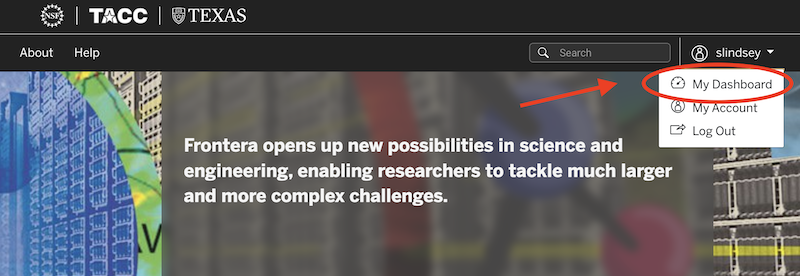
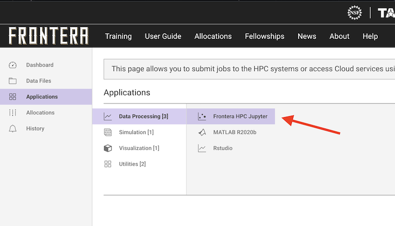
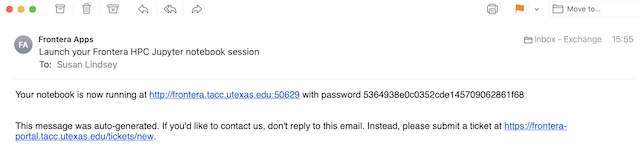

## Jupyter { #jupyter }

See the [Transferring Files](#transferring) section to learn how to transfer your datasets to Frontera, prior to starting a Jupyter session.

### Launch a Session { #jupyter-launch }

You can launch a Jupyter session via the Frontera User Portal.

1. Login to the [Frontera User Portal](https://frontera-portal.tacc.utexas.edu/login) and Select "My Dashboard" under your account name pulldown:

	<figure id="figure1">
	<figcaption></figcaption></figure>

1. From the workbench dashboard, click "Applications" in the left nav, then click "Data Processing" and select "Frontera HPC Jupyter":   

	<figure id="figure1">
	<figcaption></figcaption></figure>
	<figure id="figure2">
	<figcaption></figcaption></figure>

1. Fill out and submit the form:    

	* **User email**: you'll be be notiifed at this address once the application is running.

	* **Queue**: select which Frontera queue to use to submit the job to. Like any job, this will impact what hardware (and thus, what resources) are available to the Jupyter application.   See Frontera Queues.

	* **Maximum Job Runtime** like all jobs, this will be enforced by Slurm, so your job will be killed at this time. On the other hand, the shorter you request, the faster it will start up (typically).

	* **Job name**: this is the portal/Tapis name for the job and will be used in the notifications indicating the job has started, etc. This is just for bookkeeping so the user knows what job is being referred to.  

	<figure id="figure3">
	<figcaption></figcaption></figure>

1. Submitting the form initiates a request to the Slurm scheduler to reserve a compute node for a specified time.  In the example above, `bjones` requests a two-hour Jupyter session in Frontera's `small` queue on a single node.  **Depending upon Frontera's load, Slurm may take several minutes to several hours** to fulfill the node request.  Once Slurm allocate time for the job, you'll be automatically notified at the given email address with instructions and a password on how to connect to the session.

	<figure id="figure4">
	<figcaption></figcaption></figure>

1. Navigate to the URL specified in the email, enter your password specified in the email,  and begin your session.

### References { #jupyter-refs }

* [Jupyter Documentation](https://jupyter-notebook.readthedocs.io/en/stable/notebook.html)

