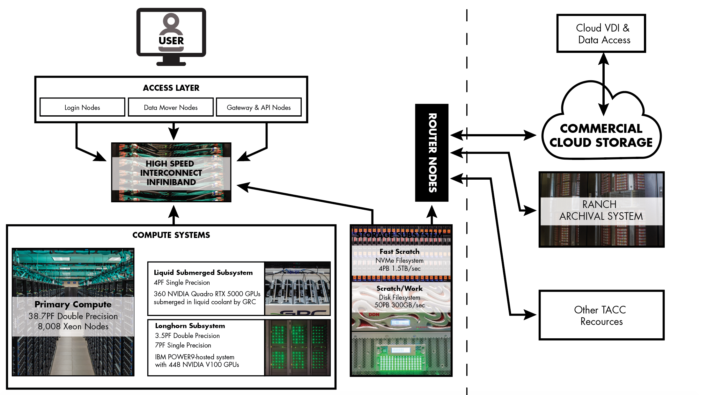

## [System Architecture](#system) { #system }

Frontera has two computing subsystems, a primary computing system focused on double precision performance, and a second subsystem focused on single precision streaming-memory computing. Frontera also has multiple storage systems, as well as interfaces to cloud and archive systems, and a set of application nodes for hosting virtual servers.

<figure id="figure1">

<figcaption>Frontera Ecosystem</figcaption></figure>

### [Cascade Lake (CLX) Compute Nodes](#system-clx) { #system-clx }

Frontera hosts 8,368 Cascade Lake (CLX) compute nodes contained in 101 racks. 

#### [Table 1. CLX Specifications](#table1) { #table1 }

Model       | Intel Xeon Platinum 8280 ("Cascade Lake")
----------- | ------------
Total cores per CLX node: | 56 cores on two sockets (28 cores/socket)
Hardware threads per core: | 1 *Hyperthreading is not currently enabled on Frontera*
Clock rate: | 2.7GHz nominal 
RAM:        | 192GB (2933 MT/s) DDR4
Cache: | 32KB L1 data cache per core; 1MB L2 per core; 38.5 MB L3 per socket. Each socket can cache up to 66.5 MB (sum of L2 and L3 capacity).
Local storage: | 144GB /tmp partition on a 240GB SSD.

### [Large Memory Nodes](#system-largememory) { #system-largememory }

Frontera hosts 16 large memory nodes featuring 2.1TB of Optane memory. Access these nodes via the [`nvdimm` queue](#queues).

#### [Table 2. Large Memory Nodes ](#table2) { #table2 }

Model | Intel Xeon Platinum 8280M ("Cascade Lake")
----------- | ------------
Total cores per CLX node:	| 112 cores on four sockets (28 cores/socket)
Hardware threads per core:	| 1 *Hyperthreading is not currently enabled on Frontera*
Clock rate:	| 2.7GHz nominal
Memory:	| **2.1 TB NVDIMM**
Cache:	| 32KB L1 data cache per core;  1MB L2 per core;  38.5 MB L3 per socket. 384 GB DDR4 RAM configured as an L4 cache Each socket can cache up to 66.5 MB (sum of L2 and L3 capacity).
Local storage: | 144GB /tmp partition on a 240GB SSD  4x 833 GB /mnt/fsdax[0,1,2,3] partitions on NVDIMM  3.2 TB usable local storage

### [GPU Nodes](#system-gpu) { #system-gpu }

Frontera hosts 90 GPU nodes contained in 4 Green Revolution Cooling ICEraQ racks. Access these nodes via the [`rtx` and `rtx-dev` queues](#queues).

#### [Table 3. Frontera GPU node specifications](#table3) { #table3 }

Feature                          | Specifications
------------------------         | ------------------------------------
Accelerators:                    | 4 NVIDIA Quadro RTX 5000 / node
CUDA Parallel Processing Cores:  | 3072 / card
NVIDIA Tensor Cores:             | 384 / card
GPU Memory:                      | 16GB GDDR6 / card
CPUs:                            | 2 Intel Xeon E5-2620 v4 (“Broadwell”)
RAM:                             | 128GB (2133 MT/s) DDR4
Local storage:                   | 144GB /tmp partition on a 240GB SSD.

### [Login Nodes](#system-login) { #system-login }

Frontera's four login nodes are Intel Xeon Platinum 8280 ("Cascade Lake") nodes with 56 cores and 192 GB of RAM. The login nodes are configured similarly to the compute nodes. However, since these nodes are shared, limits are enforced on memory usage and number of processes. Please use the login node for file management, compilation, and data movement. Any computing should be done within a batch job or an interactive session on compute nodes.

### [Network](#system-network) { #system-network }

The interconnect is based on Mellanox HDR technology with full HDR (200 Gb/s) connectivity between the switches and HDR100 (100 Gb/s) connectivity to the compute nodes. A fat tree topology employing six core switches connects the compute nodes and the `$HOME` and `$SCRATCH` filesystems. There are two 40-port leaf switches in each rack. Half of the nodes in a rack (44) connect to 22 downlinks of a leaf switch as pairs of HDR100 (100 Gb/s) links into HDR200 (200 Gb/s) ports of the leaf switch. The other 18 ports are uplinks to the six cores switches. The disparity in the number of uplinks and downlinks creates an oversubscription of 22/18.

