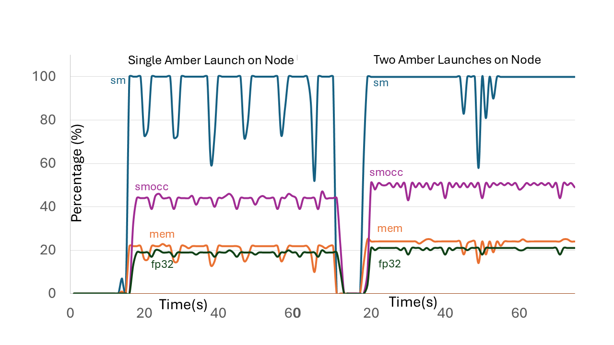

## NVIDIA  MPS { #mps }

NVIDIA's [Multi-Process Service](https://docs.nvidia.com/deploy/mps/) (MPS) allows multiple processes to share a GPU efficiently by reducing scheduling overhead. MPS can improve GPU resource sharing between processes when a single process cannot fully saturate the GPU's compute capacity. 

Follow these steps to configure MPS on Vista for optimized multi-process workflows:

1. **Configure Environment Variables**

	Set environment variables to define where MPS stores its runtime pipes and logs. In the example below, these are placed in each node's `/tmp` directory.  The `/tmp` directory is ephemeral and cleared after a job ends or a node reboots.  Add these lines to your job script or shell session:

	```job-script
	# Set MPS environment variables
	export CUDA_MPS_PIPE_DIRECTORY=/tmp/nvidia-mps
	export CUDA_MPS_LOG_DIRECTORY=/tmp/nvidia-log
	```

	To retain these logs for later analysis, specify directories in `$SCRATCH`, `$WORK`, or `$HOME` file systems instead of `/tmp`. 

2. **Launch MPS Control Daemon**

	Use `ibrun` to start the MPS daemon across all allocated nodes. This ensures one MPS control process per node:

	```job-script
	# Launch MPS daemon on all nodes
	export TACC_TASKS_PER_NODE=1  # Force one task per node
	ibrun -np $SLURM_NNODES nvidia-cuda-mps-control -d
	unset TACC_TASKS_PER_NODE     # Reset to default task distribution
	```

3. **Submit Your GPU Job**

	After enabling MPS, run your CUDA application as usual. For example:

	```job-script
	ibrun ./your_cuda_executable 
	```

### Sample Job Script { #scripts }

Incorporating the above elements into a job script may look like this:

```job-script
#!/bin/bash
#SBATCH -J mps_gpu_job           # Job name
#SBATCH -o mps_job.%j.out        # Output file (%j = job ID)
#SBATCH -t 01:00:00              # Wall time (1 hour)
#SBATCH -N 2                     # Number of nodes
#SBATCH -n 8                     # Total tasks (4 per node)
#SBATCH -p gh                    # GPU partition (modify as needed)
#SBATCH -A your_project          # Project allocation

# 1. Configure environment
export CUDA_MPS_PIPE_DIRECTORY=/tmp/nvidia-mps
export CUDA_MPS_LOG_DIRECTORY=/tmp/nvidia-log

# 2. Launch MPS daemon on all nodes
echo "Starting MPS daemon..."
export TACC_TASKS_PER_NODE=1     # Force 1 task/node
ibrun -np $SLURM_NNODES nvidia-cuda-mps-control -d
unset TACC_TASKS_PER_NODE
sleep 5                          # Wait for daemons to initialize

# 3. Run your CUDA application
echo "Launching application..."
ibrun ./your_cuda_executable     # Replace with your executable
```

### Notes on Performance

MPS is particularly effective for workloads characterized by:

* Fine-grained GPU operations (many small kernel launches)
* Concurrent processes sharing the same GPU
* Underutilized GPU resources in single-process workflows

You may verify performance gains for your use case using the following command to monitor the node that your job is running on (e.g., `c608-052`):

```cmd-line
login1$ ssh c608-052
c608-052$ nvidia-smi dmon --gpm-metrics=3,12 -s u
```

The side-by-side plots in Figure 1 illustrate the performance enhancement obtained by running two GPU processes simultaneous on a single Hopper node with MPS. The GPU performance improvement is ~12%, compared to no improvement without MPS. Also, the setup cost on the CPU (about 12 seconds) is completely overlapped, resulting in in a 1.2x total improvement for 2 simultaneous Amber executions. Even better performance is expected for applications which don't load the GPU as much as Amber.

 
<figure><figcaption>Figure 1.  Usage (SM, Memory and FP32) and SM occupancy percentages for single and dual Amber GPU executions (single-precision) on Hopper H200.</figcaption></figure>


